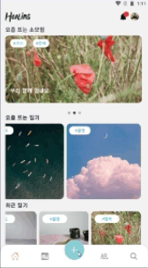
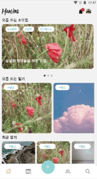
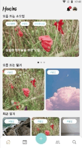
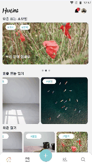
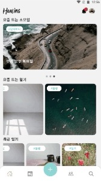
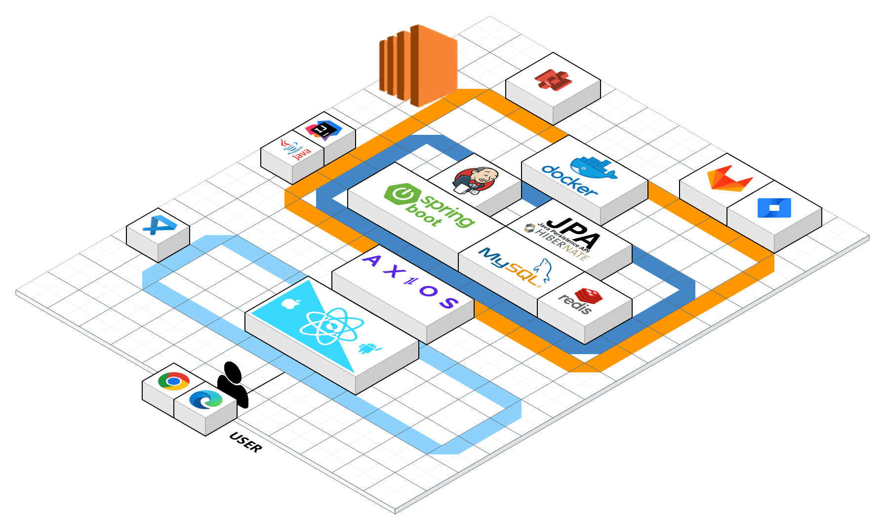
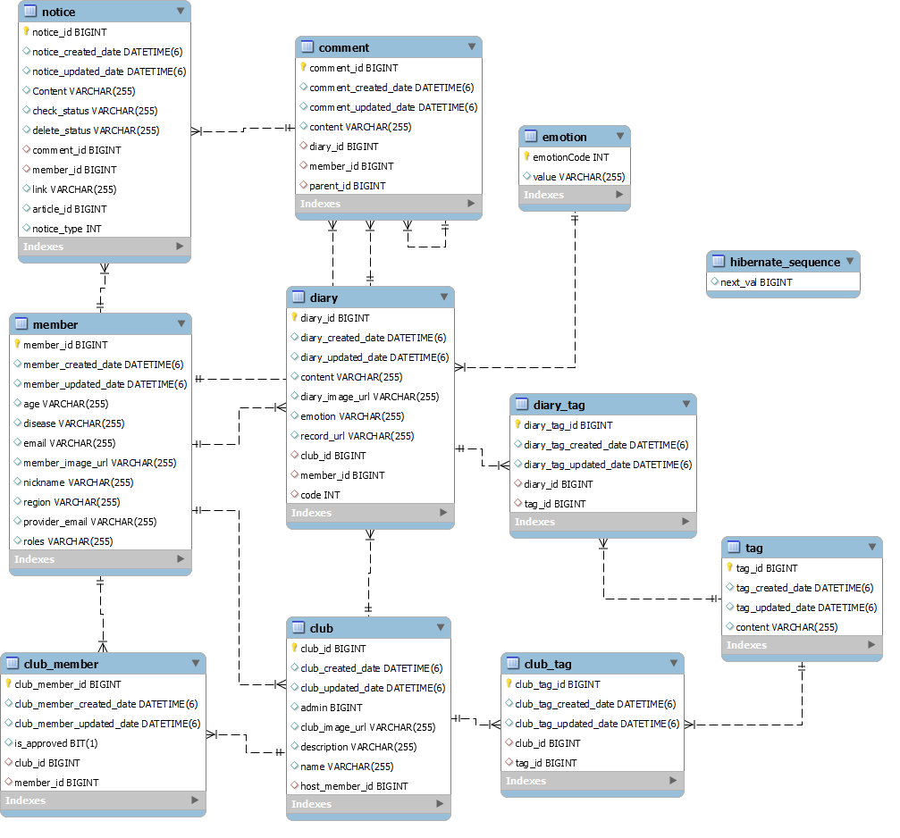

<!-- Improved compatibility of back to top link: See: https://github.com/othneildrew/Best-README-Template/pull/73 -->

<a name="readme-top"></a>

<!--
*** Thanks for checking out the Best-README-Template. If you have a suggestion
*** that would make this better, please fork the repo and create a pull request
*** or simply open an issue with the tag "enhancement".
*** Don't forget to give the project a star!
*** Thanks again! Now go create something AMAZING! :D
-->

<!-- PROJECT SHIELDS -->

<!--
*** I'm using markdown "reference style" links for readability.
*** Reference links are enclosed in brackets [ ] instead of parentheses ( ).
*** See the bottom of this document for the declaration of the reference variables
*** for contributors-url, forks-url, etc. This is an optional, concise syntax you may use.
*** https://www.markdownguide.org/basic-syntax/#reference-style-links
-->

<!-- [![Contributors][contributors-shield]][contributors-url]
[![Forks][forks-shield]][forks-url]
[![Stargazers][stars-shield]][stars-url]
[![Issues][issues-shield]][issues-url]
[![MIT License][license-shield]][license-url]
[![LinkedIn][linkedin-shield]][linkedin-url] -->

<br><br>

<!-- PROJECT LOGO -->
<div align="center">

<div/>
<h3 align="center">힐링 다이어리</h3>

<p align="center">
    신체적 불편함을 겪는 질병 경험자들의 사회심리적 지지를 돕는 음성 일기 커뮤니티
  </p>
</div>
<br><br><br>

<!-- ABOUT THE PROJECT -->

# 🍃 프로젝트 소개

<!-- [![Product Name Screen Shot][product-screenshot]](https://example.com) -->

SSAFY 8기 특화프로젝트 (2023.02.27 ~ 2023.04.07) 

힐링 다이어리는 환자들을 위한 음성 다이어리 앱입니다.

음성 녹음을 통한 일기 작성으로 신체가 불편해 일기를 작성하기 어려운 분들도 쉽게 매일의 일상을 기록하고 감정 분석으로 나의 하루를 더 명확하게 되돌아볼 수 있습니다.

음성을 텍스트로 변환 후 녹음과 함께 저장하고, 선택적으로 해시태그를 달 수 있습니다. 목소리로만 기록한 일기일지라도 내용이나 태그로 나중에 쉽게 검색할 수 있습니다.

개인적인 비밀일기 뿐만 아니라 소모임을 생성해 함께 일상을 공유하고, 나와 같은 질병 혹은 지역의 다른 사람들의 일기나 소모임을 추천하여 더 다채로운 활동을 할 수 있습니다.
<br><br><br>

# 🎨 기능 소개

| 소셜 로그인 및 메인 화면                                              | 일기 작성                                                         | 캘린더 및 감정 통계 조회                                                       |
|:-----------------------------------------------------------:|:-------------------------------------------------------------:|:--------------------------------------------------------------------:|
|  |  |  |

| 소모임 생성                                                         | 소모임 초대                                                        |
|:--------------------------------------------------------------:|:-------------------------------------------------------------:|
|  |  |

| 일기 및 소모임 검색                                                   | 소모임 일기 조회                                                           | 댓글 조회 및 작성                                                         |
|:-------------------------------------------------------------:|:-------------------------------------------------------------------:|:------------------------------------------------------------------:|
|  |  |  |

<br><br>

# ⚒기술 스택

|                      |                                                                                                                                                                                                                                |
|:--------------------:|:------------------------------------------------------------------------------------------------------------------------------------------------------------------------------------------------------------------------------:|
| <b>Front-end</b>     | [![Javascript][Javascript.com]][Javascript-url][![ReactNative][ReactNative.com]][ReactNative-url][![Expo][Expo.com]][Expo-url]                                                                                                 |
| <b>Back-end</b>      | [![Java][Java.com]][Java-url][![SpringBoot][SpringBoot.com]][SpringBoot-url][![SpringSecurity][SpringSecurity.com]][SpringSecurity-url][![Gradle][Gradle.com]][Gradle-url]                                                     |
| <b>Database</b>      | [![Mysql][Mysql.com]][Mysql-url][![Redis][Redis.com]][Redis-url]                                                                                                                                                               |
| <b>Storage</b>       | [![AmazonS3][AmazonS3.com]][AmazonS3-url]                                                                                                                                                                                      |
| <b>DevOps</b>        | [![Git][Git.com]][Git-url][![GitLab][GitLab.com]][GitLab-url][![AmazonEC2][AmazonEC2.com]][AmazonEC2-url][![Docker][Docker.com]][Docker-url][![Jenkins][Jenkins.com]][Jenkins-url][![Sonarqube][Sonarqube.com]][Sonarqube-url] |
| <b>Collaboration</b> | [![Jira][Jira.com]][Jira-url][![Notion][Notion.com]][Notion-url]                                                                                                                                                               |

<br><br>

# ⚙프로젝트 구성도

| 아키텍처(Architecture)                                                                    |
|:-------------------------------------------------------------------------------------:|
| ![Architecture][] |

| 개체-관계 모델(ERD)                                                       |
|:-------------------------------------------------------------------:|
| ![erd][] |

<br><br><br>

<!-- GETTING STARTED -->

# 💻 실행 방법

### Server Build

---

<br>

1. 원격 저장소 복제
   
   ```sh
   $ git clone https://lab.ssafy.com/s08-ai-speech-sub2/S08P22B203.git
   ```
   
   <br>

2. 프로젝트 폴더 > BE > src > main > resources 이동
   
   ```sh
   $ cd BE
   $ cd src
   $ cd main
   $ cd resources
   ```
   
   <br>

3. application.properties 작성
- 프로젝트 첫 빌드시 spring.jpa.hibernate.ddl-auto=create 로 작성
- 이후에는 spring.jpa.hibernate.ddl-auto=none 으로 변경

<br>

```sh
server.port=8080
spring.mvc.pathmatch.matching-strategy=ant_path_matcher

# SQL
spring.datasource.url=${DB_URL}
spring.datasource.username=${DB_NAME}
spring.datasource.password=${DB_PASSWORD}
spring.datasource.driver-class-name=com.mysql.cj.jdbc.Driver
spring.jpa.show-sql=true
spring.jpa.database-platform=org.hibernate.dialect.MySQL8Dialect

# hibernate
spring.jpa.database=mysql
spring.jpa.hibernate.ddl-auto=create
spring.jpa.hibernate.naming.strategy=org.hibernate.cfg.ImprovedNamingStrategy
spring.jpa.hibernate.naming.physical-strategy=org.hibernate.boot.model.naming.PhysicalNamingStrategyStandardImpl
spring.jpa.generate-ddl=false
spring.jpa.properties.hibernate.format_sql=true
spring.jpa.properties.hibernate.enable_lazy_load_no_trans=true

spring.redis.host=j8b203.p.ssafy.io
spring.redis.port=6379
spring.redis.password=${DB_PASSWORD}

# jwt
jwt.secret=${JWT_SECRET}
jwt.expiration-accesstoken-minutes = 180
jwt.expiration-refreshtoken-minutes = 10080
jwt.bearer = Bearer

#S3
cloud.aws.credentials.accessKey = ${ACCESS_KEY_AWS_S3}
cloud.aws.credentials.secretKey = ${SECRET_KEY_AWS_S3}
cloud.aws.s3.bucket = ${BUCKET_ADDRESS}
cloud.aws.region.static = ap-northeast-2
cloud.aws.stack.auto = false
cloud.aws.profiles.include = aws
spring.servlet.multipart.maxFileSize=10MB
spring.servlet.multipart.maxRequestSize=30MB
default-image-s3 = ${DEFAULT_IMAGE_S3}

# clova
clova.speech.secret-key = ${SECRET_KEY_CLOVA_SPEECH}
clova.speech.invoke-url = ${INVOKE_URL_CLOVA_SPEECH}
clova.sentiment.client-id = ${CLIENT_ID_NAVER_AI}
clova.sentiment.client-secret = ${CLIENT_SECRET_NAVER_AI}
```

<br>

4. 프로젝트 폴더 루트 경로로 이동
   
   ```sh
   $ cd BE
   ```
   
   <br>

5. 프로젝트 빌드
   
   ```sh
   $ ./gradlew build
   ```
   
   <br>

6. 빌드 폴더 이동 후 jar 파일 실행
   
   ```sh
   $ cd build
   $ java -jar [파일명].jar
   ```
   
   <br>   

### Client build

1. 원격 저장소 복제
   
   ```sh
   $ git clone https://lab.ssafy.com/s08-ai-speech-sub2/S08P22B203.git
   ```
   
   <br>

2. 프로젝트 폴더 > FE 이동
   
   ```sh
   $ cd FE
   ```
   
   <br>
   
   1. [expo.dev](http://expo.dev)에 접속해서 새로운 프로젝트 생성
   2. 프로젝트에서 생성된 projectid 복사
   3. app.json 변경

```json
{
  "expo": {
    "name": "diary",
    "slug": "diary",
    "version": "1.0.0",
    "orientation": "portrait",
    "icon": "./assets/icon.png",
    "userInterfaceStyle": "light",
    "backgroundColor": "#f3f3f3",
    "scheme": "com.ssafy.healingdiary",
    "jsEngine": "hermes",
    "splash": {
      "image": "./assets/splash.png",
      "resizeMode": "contain",
      "backgroundColor": "#ffffff"
    },
    "assetBundlePatterns": ["**/*"],
    "ios": {
      "jsEngine": "jsc",
      "supportsTablet": true,
      "bundleIdentifier": "com.ssafy.healingdiary"
    },
    "android": {
      "package": "com.ssafy.healingdiary",
      "adaptiveIcon": {
        "foregroundImage": "./assets/adaptive-icon.png",
        "backgroundColor": "#ffffff"
      }
    },
    "web": {
      "favicon": "./assets/favicon.png"
    },
    "packagerOpts": {
      "sourceExts": ["js", "json", "ts", "tsx", "jsx"]
    },
    "extra": {
      "eas": {
        "projectId": "projectid"
      }
    }
  }
}
```

1. `eas-build:configure` 입력 후 `android` 선택
2. `eas-build -p android --profile preview`

<br><br><br>

<!-- CONTACT -->

# 👥 팀 소개

| 강정훈(팀장)  | 김민준      | 김혜정      | 백정은               | 박주승       | 한상준       |
|:--------:|:--------:|:--------:|:-----------------:|:---------:|:---------:|
| Back-end | Back-end | Back-end | Back-end<br>CI/CD | Front-end | Front-end |

<br>

| 팀원  | 프로젝트 소감 및 후기                                                                                                                                                                                                                                                                                                                                                                                                             |
|:---:|:------------------------------------------------------------------------------------------------------------------------------------------------------------------------------------------------------------------------------------------------------------------------------------------------------------------------------------------------------------------------------------------------------------------------ |
| 강정훈 | 이전까지 스프링이라는 프레임워크를 개인적으로 강의를 들으며 공부하긴 했지만, 프로젝트에 실제로 내가 코드를 짜보는 것은 처음이었다. 배운 것을 기반으로 코드를 짜는 것은 재미있는 일이었다.사용자 인증과 인가를 스프링 시큐리티와 jwt토큰을 통해 구현해 본 경험이 좋았다.전 프로젝트 대비 체계적인 기획 및 운영이 좋았다.이 전에는 프론트와 백엔드가 서로 기능별로 붙어서 작업을 진행하는 비효율적인 작업을 했는데, 이번 프로젝트에는 문서 자체를 체계적으로 짜서, 문서가 이해가 안되거나, 헷갈릴 때만, 소통을 하면 되는 효율적인 상황이 이루어졌다. 그런 점이 매우 기뻤다.                                                                                          |
| 김민준 | 스프링 프레임워크를 처음 접했음에도 팀원들 덕분에 프로젝트를 잘 마무리할 수 있었습니다. 백엔드 포지션을 맡으면서 통신 흐름, 데이터베이스 다루기, 예외 처리 등 사소해 보이지만 중요한 것들을 깨닫게 되었습니다.<br>뿐 아니라, 컴퓨터 공학 공부의 필요성, 코드의 의미를 이해하고 사용하는 태도, 그리고 팀 프로젝트에서 소통의 중요성을 깨달은 소중한 프로젝트 기간이었습니다.<br>                                                                                                                                                                                                   |
| 김혜정 | 좋은 팀원들과 함께해서 더욱 뜻깊은 경험이었습니다. 동적쿼리를 해결하기 위해 QueryDSL을 처음 사용해보았는데, BooleanExpression으로 1개의 함수에서 조건을 동적으로 조절할 수 있는 점이나, 런타임이 아니라 컴파일 단계에서 SQL syntax error를 감지할 수 있어서 좋았습니다. 일대다 관계에서 1+N 문제 없이 한번에 페이징을 하기 위해 머리를 싸맸던 기억이 납니다. 또, request를 파일과 dto를 같이 받을 수 있도록 API를 구현했는데 잘 안돼서 이유를 몰라 한참을 고민했는데, react native에서는 불가능하다는 말에 급하게 수정했던 것이 기억에 남습니다. 사용하는 툴을 잘 이해하고 있는 것도 중요하다고 느꼈습니다. 이번 프로젝트에서 얻은 교훈들이 앞으로 큰 도움이 될 것 같습니다. |
| 백정은 | 배워서 익힌 것보다 앞으로 익힐 것이 더 많은 저에게 이번 특화 프로젝트를 진행하면서 도전의식을 갖게 해주었고 팀원들 역시 저를 믿고 배포 담당을 맡겨준 것에 대해 감사하게 생각합니다. 특히 배포 과정에서 방화벽 이슈가 발생했을 때도 서로 이해해주고 응원해주는 팀원들 덕분에 책임감을 갖고 프로젝트에 임할 수 있었습니다. 팀원들과 함께 고민하고 문제를 해결하는 과정에서 다양한 아이디어와 시각을 얻을 수 있어서 개인적으로도 성장할 수 있는 기회가 되었습니다. 마지막까지 팀원들과 최종 결과물을 위해 노력하는 모습들을 통해 나날이 성장하고 배워갑니다. 감사합니다.                                                                                               |
| 박주승 | STT 기술을 활용한 특화 프로젝트를 진행하며 많은 것을 얻었습니다. 우선 인공지능 기술의 중요성을 깨닫게 해주었습니다. 또한 프로젝트 과정에서 협업, 커뮤니케이션, 문제 해결 능력 등 다양한 기술을 배웠고, 이를 통해 개인적으로 성장할 수 있었습니다. STT 기술의 발전이 사회에 미치는 영향을 경험하며, 앞으로의 기술 발전과 혁신에 더욱 기대가 크게 되었습니다. 이 프로젝트를 통해 얻은 지식과 경험을 다양한 분야에서 활용하고 싶습니다.                                                                                                                                                                   |
| 한상준 | 리액트 네이티브를 이용한 프로젝트를 진행하면서, 기존의 웹 개발 방식과는 다른 새로운 개발 방법을 경험할 수 있었습니다. 네이티브 앱과 유사한 성능과 사용자 경험을 제공할 수 있지만, 특정 모바일 기기나 OS에 대한 제약 사항과 복잡한 UI 구현, 불완전한 기능등 어려움도 있었지만 해결해나가면서 성장할 수 있었습니다.                                                                                                                                                                                                                                       |

<p align="right">(<a href="#readme-top">back to top</a>)</p>

<!-- MARKDOWN LINKS & IMAGES -->

<!-- https://www.markdownguide.org/basic-syntax/#reference-style-links -->

[contributors-shield]: https://img.shields.io/github/contributors/github_username/repo_name.svg?style=for-the-badge
[contributors-url]: https://github.com/github_username/repo_name/graphs/contributors
[forks-shield]: https://img.shields.io/github/forks/github_username/repo_name.svg?style=for-the-badge
[forks-url]: https://github.com/github_username/repo_name/network/members
[stars-shield]: https://img.shields.io/github/stars/github_username/repo_name.svg?style=for-the-badge
[stars-url]: https://github.com/github_username/repo_name/stargazers
[issues-shield]: https://img.shields.io/github/issues/github_username/repo_name.svg?style=for-the-badge
[issues-url]: https://github.com/github_username/repo_name/issues
[license-shield]: https://img.shields.io/github/license/github_username/repo_name.svg?style=for-the-badge
[license-url]: https://github.com/github_username/repo_name/blob/master/LICENSE.txt
[linkedin-shield]: https://img.shields.io/badge/-LinkedIn-black.svg?style=for-the-badge&logo=linkedin&colorB=555
[linkedin-url]: https://linkedin.com/in/linkedin_username
[product-screenshot]: images/screenshot.png
[erd]: /uploads/f19eaf12d4269b18dcaa10c70480897a/erd.png
[architecture]: /uploads/5e2934b4d814033295285c59b14fa934/architecture.png

<!-- back-end -->

[Java.com]: https://img.shields.io/badge/java-007396?style=for-the-badge&logo=java&logoColor=white
[Java-url]: https://www.java.com/
[SpringBoot.com]: https://img.shields.io/badge/springboot-6DB33F?style=for-the-badge&logo=springboot&logoColor=white
[SpringBoot-url]: https://spring.io/
[Gradle.com]: https://img.shields.io/badge/gradle-02303a?style=for-the-badge&logo=gradle&logoColor=white
[Gradle-url]: https://gradle.org/
[SpringSecurity.com]: https://img.shields.io/badge/Spring%20security-6DB33F?style=for-the-badge&logo=Spring%20security&logoColor=white
[SpringSecurity-url]: https://docs.spring.io/spring-security/reference/

<!-- front-end -->

[Javascript.com]: https://img.shields.io/badge/javascript-F7DF1E?style=for-the-badge&logo=javascript&logoColor=black
[Javascript-url]: https://developer.mozilla.org/ko/docs/Web/JavaScript
[ReactNative.com]: https://img.shields.io/badge/react%20native-61DAFB?style=for-the-badge&logo=react&logoColor=black
[ReactNative-url]: https://reactnative.dev/
[Expo.com]: https://img.shields.io/badge/Expo-000020?style=for-the-badge&logo=Expo&logoColor=white
[Expo-url]: https://reactnative.dev/

<!-- DB -->

[Mysql.com]: https://img.shields.io/badge/mysql-3e6e93?style=for-the-badge&logo=mysql&logoColor=white
[Mysql-url]: https://www.mysql.com/
[Redis.com]: https://img.shields.io/badge/Redis-DC382D?style=for-the-badge&logo=Redis&logoColor=white
[Redis-url]: https://redis.io/
[AmazonS3.com]: https://img.shields.io/badge/Amazon%20S3-569A31?style=for-the-badge&logo=Amazon%20S3&logoColor=white
[AmazonS3-url]: https://redis.io/

<!-- DevOps -->

[AmazonEC2.com]: https://img.shields.io/badge/Amazon%20EC2-FF9900?style=for-the-badge&logo=Amazon%20EC2&logoColor=white
[AmazonEC2-url]: https://aws.amazon.com/ko/ec2/
[Docker.com]: https://img.shields.io/badge/Docker-2496ED?style=for-the-badge&logo=Docker&logoColor=white
[Docker-url]: https://www.docker.com/
[Jenkins.com]: https://img.shields.io/badge/Jenkins-D24939?style=for-the-badge&logo=Jenkins&logoColor=white
[Jenkins-url]: https://www.jenkins.io/
[Git.com]: https://img.shields.io/badge/git-F05032?style=for-the-badge&logo=git&logoColor=white
[Git-url]: https://git-scm.com/
[GitLab.com]: https://img.shields.io/badge/gitlab-FC6D26?style=for-the-badge&logo=gitlab&logoColor=white
[GitLab-url]: https://about.gitlab.com/
[Sonarqube.com]: https://img.shields.io/badge/Sonarqube-4E9BCD?style=for-the-badge&logo=Sonarqube&logoColor=white
[Sonarqube-url]: https://www.sonarsource.com/products/sonarqube/

<!-- Collaboration -->

[Jira.com]: https://img.shields.io/badge/jira-0052CC?style=for-the-badge&logo=jira%20software&logoColor=white
[Jira-url]: https://www.atlassian.com/ko/software/jira
[Notion.com]: https://img.shields.io/badge/notion-000000?style=for-the-badge&logo=notion&logoColor=white
[Notion-url]: https://www.atlassian.com/ko/software/jira
